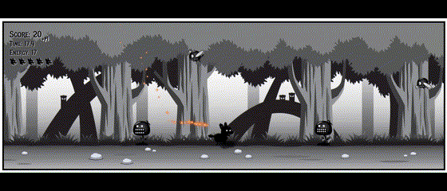

# JavaScript Game Development

## Overview
This tutorial provided invaluable insights into Vanilla JavaScript, uncovering its quirks and powerful features. It consists of 9 projects, varying in difficulty, each focusing on different concepts. Completing the tutorial took approximately 30 hours, which included watching the lessons, taking detailed notes, testing, and debugging along the way.

### Project 1: Vanilla JavaScript sprite animation techniques
- Cycling through frames by cropping and scaling images.
- Using data structure to map sprite sheet frames for flexible animation control.
- Different animation using drop-down menu.

#### Controls
- Choose Animation with drop-down menu

### Project 2: Parallax backgrounds with JavaScript
- Learn to create parallax scrolling effects in 2D JavaScript games by moving background images at different speeds to simulate depth.
- Understand how to set up the HTML canvas, manage image layers using JavaScript classes, and create a seamless scrolling background.
- Discover how to control the scrolling speed dynamically and optimize your code for performance.

#### Controls
- Drag slider to control `gameSpeed`

### Project 3: Enemy movement patterns
- Learn fundamental vanilla JavaScript principles and techniques by building four small projects that generate groups of animated, computer-controlled characters.
- Understand core concepts like JavaScript classes, animation loops using `requestAnimationFrame`, and array methods like `push` and `forEach`.
- Explore different movement animation patterns, including random jumpy, horizontal wavy (using sine waves), circular, and independent movement, while learning to animate sprite sheets by cropping individual frames.

#### Controls
- Select different sprite to view movement pattern

### Project 4: Collision animations from a sprite sheet
- Learn to add visual and audio feedback to JavaScript games to enhance user engagement.
- Understand how to use JavaScript classes to create reusable game elements and animate sprite sheets.
- Explore how to handle user interactions, create animation loops, and rotate objects on the canvas.

#### Controls
- Click on black canvas

### Project 5: Point & shoot game
- Learn to build a shooter game using JavaScript and HTML5 canvas, focusing on front-end web development skills.
- Understand techniques for pixel-perfect collision detection, consistent game speed using timestamps, and efficient array methods.
- Explore modern JavaScript syntax, animation techniques, and the use of free premium sprite sheets in game development.

#### Controls
- Click to shoot

### Project 6: Enemy variety in JavaScript games
- Structuring JavaScript code for game development, emphasizing modularity and readability.
- Implemented inheritance using JavaScript's extends keyword to create specialized game entities from a base class, allowing for code reuse and unique behaviors.
- Building a simple animation project, covering canvas setup, class creation for game elements, and the implementation of an animation loop.

#### Controls
- Arrow keys for movement

### Project 7: Side-scroller game with mobile support
- The `Enemy` class is responsible for generating and managing various enemy types with unique behaviors and characteristics.  
- Implements collision detection, score tracking, and sprite sheet animations for smooth, dynamic gameplay.  
- Utilizes circular hit boxes and calculates the distance between enemy and player objects to accurately detect collisions.

#### Controls
- Arrow keys for movement

### Project 8: State management in JavaScript games
- Implemented the state design pattern in JavaScript to manage different character behaviors within a side-scroller game.
- Basic game structure using HTML, CSS, and JavaScript modules, along with the creation of a `Player` class, an `InputHandler`, and distinct state classes for various player actions.
- Handle player input, transition between different animation states, and utilize timestamps and delta time for smooth and consistent animation.

#### Controls
- Arrow keys for movement

### Project 9: Final endless runner game with all the features

- Integrated all concepts from previous projects into a unified, expansive codebase.  
- Applied the state design pattern to efficiently manage player actions and control sprite sheet animations, allowing animation speed to function independently from the game’s overall frame rate.  
- Designed three unique enemies, each with distinct movement patterns that present varied challenges to the player.  
- Enhanced the tutorial by adding dynamic sound effects, background music, a restart button, and an energy mechanic that restricts rolling actions based on the player’s available energy.

#### Controls

- Arrow keys for movement, hold `r` for rolling state
